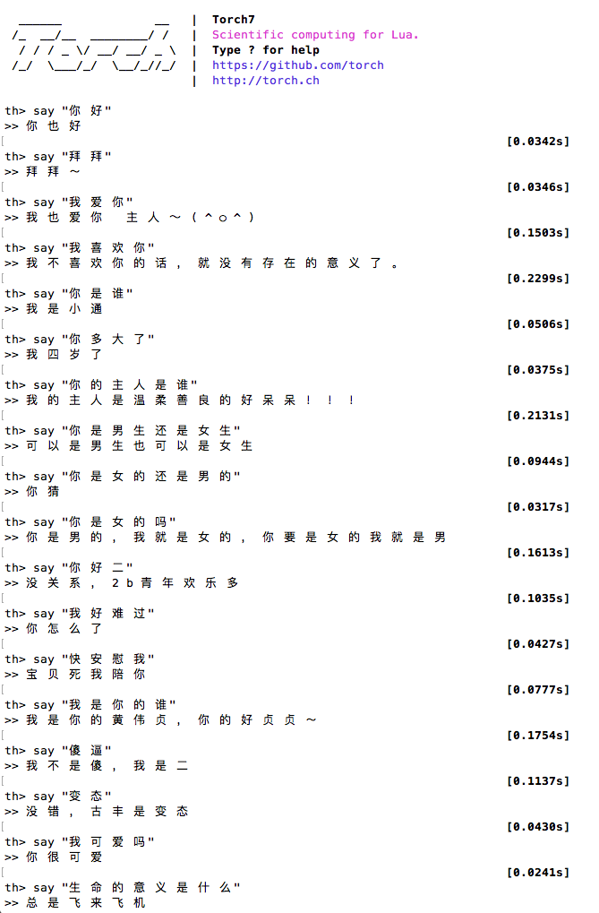
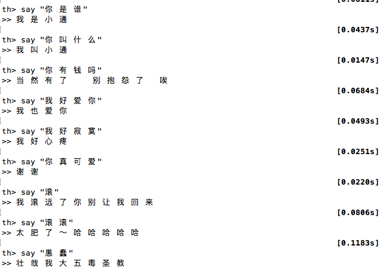

# Neural Conversational Model in Torch

Forked from https://github.com/chenb67/neuralconvo

如果训练中遇到问题请先翻原始fork的issue，这里只是改成中文而已！

## How
Use https://github.com/dgkae/dgk_lost_conv as training corpus. The chinese sentenses should be splited by semantic words, using '/'. We modify cornell_movie_dialog.lua to support it. Lua save all string(e.g. chinese) all in multibyte, so in chinese the formal pl.lexer is not working. We use outsider word-splitting tool and using '/' as the tag.

## Result

## Rwt
更多信息

1.聊天群：

2.公众号

3.知乎

